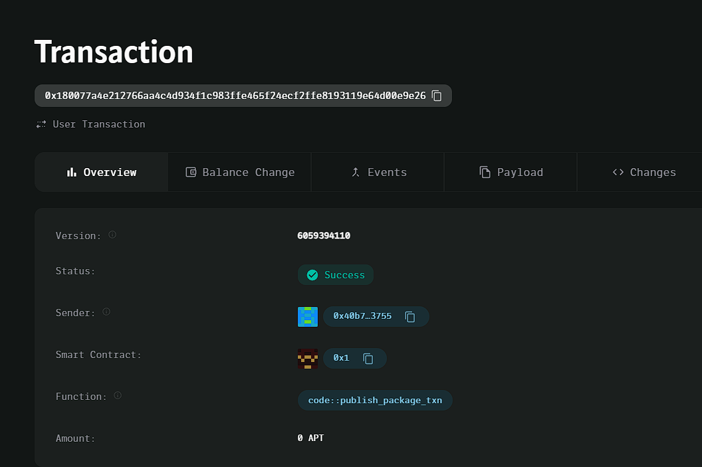

### Deployed smartcontract address: 0x180077a4e212766aa4c4d934f1c983ffe465f24ecf2ffe8193119e64d00e9e26

### Screenshot: 

# Decentralized Skill Validation

## Project Description

The **Decentralized Skill Validation** dApp allows users to create and complete skill validation challenges. It provides a platform where users can issue tasks or challenges to demonstrate and validate skills, with proof of completion stored on the blockchain.

## Vision

Our vision is to create a transparent and immutable system where individuals can showcase their abilities and prove skill competence in a decentralized and trustless manner. By leveraging blockchain technology, we aim to eliminate bias and provide a verifiable method for skill assessment.

## Key Features

- **Create Skill Challenges:** Users can issue tasks that represent a specific skill validation.
- **Complete Challenges:** Users can mark challenges as completed, proving that the required skill has been demonstrated.
- **Immutable Records:** Once a challenge is created or completed, the data is securely stored on the blockchain, ensuring transparency and verifiability.

## Future Scope

- **Reputation System:** Introduce a reputation score based on the number and complexity of completed challenges.
- **Skill Verification:** Allow third parties or institutions to verify the completed challenges as proof of skill.
- **Token Incentives:** Implement a reward mechanism where users earn tokens for successfully completing challenges.
- **Challenge Ratings:** Users could rate the difficulty and quality of the challenges after completion, enabling better curation of tasks.
- **Decentralized Governance:** Introduce a DAO-based governance system to allow community-driven decision-making for the platform's future enhancements.

